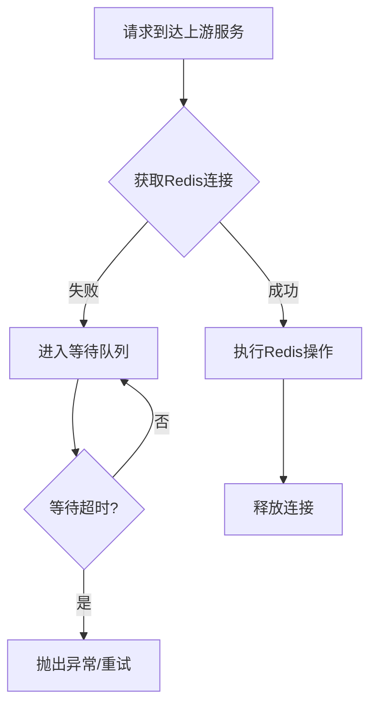

## DeepSeek R1 回答（更详细）

### 思考过程

<think>

嗯，用户现在的问题是关于Redis最大连接数设置过小导致上游服务内存激增的情况。之前已经讨论过连接数激增导致Redis内存上升的问题，但这次的情况相反，是连接数限制太小导致上游服务出问题。我需要仔细分析这种情况的可能原因，并给出合理的解释。

首先，用户提到的是最大连接数限制设置过小，导致上游服务内存激增。这看起来有点矛盾，因为通常连接数不够会导致请求被阻塞或拒绝，但为什么会内存激增呢？我需要考虑上游服务在处理请求时的机制。

可能的原因有几个方面：

1. 请求堆积导致内存占用增加：当Redis连接池的最大连接数不足时，上游服务的请求无法立即获取到连接，这些请求会被阻塞在队列中等待。如果请求量很大，队列中的等待请求会累积，每个请求可能携带大量数据，导致内存占用上升。例如，每个请求可能需要缓存请求参数、响应结果等数据，堆积的请求会占用大量内存。
2. 线程/协程阻塞导致资源无法释放：如果上游服务使用同步阻塞的方式调用Redis，当连接池耗尽时，处理请求的线程会被阻塞等待连接。随着阻塞的线程增多，线程本身占用的内存（如线程栈）会增加，同时这些线程可能持有其他资源，如数据库连接、文件句柄等，进一步导致内存泄漏。
3. 连接池配置不当引发的连锁反应：例如，连接池的最大等待时间（max-wait）设置过长，导致请求线程长时间挂起，无法释放资源。或者连接池的验证机制（test-on-borrow）导致每次获取连接时进行验证，增加了获取连接的时间，加剧了请求堆积。
4. 客户端缓冲区溢出：当Redis服务器响应速度跟不上请求速度时，客户端输出缓冲区可能积压未读取的数据，导致内存占用增加。特别是如果使用了Pub/Sub或者大量批量操作，这种情况更容易发生。

接下来需要验证这些可能性。例如，检查上游服务的线程堆栈情况，查看是否有大量线程阻塞在获取Redis连接的地方。同时，监控连接池的状态，如活跃连接数、等待队列长度等指标，以及内存增长与请求堆积的关系。

另外，需要考虑上游服务的设计模式。例如，如果是异步非阻塞的框架，可能不会因为连接不足而阻塞线程，但如果是同步模型，线程阻塞会导致资源迅速耗尽。此外，连接池的实现方式（如Apache Commons Pool、HikariCP等）也会影响行为，不同的池实现可能有不同的等待策略和资源管理机制。

可能还需要检查是否有重试机制导致请求被多次提交，或者超时设置不合理，导致请求长时间挂起，从而累积在内存中。例如，如果每次获取连接失败后，客户端进行重试，而没有正确的退避策略，可能会导致请求风暴，进一步加剧连接池的压力和内存消耗。

总结来说，问题的核心在于连接数不足导致上游服务的请求处理流程受阻，进而引发资源（内存、线程）的累积。需要从连接池配置、线程模型、请求处理逻辑等多个方面进行排查和优化。
</think>


您描述的现象看似矛盾（Redis连接数限制过小 → 上游服务内存激增），但实际是典型的资源竞争引发的连锁反应。让我们从底层机制深入分析：

### 核心机制：资源竞争引发的内存堆积

当Redis连接池的`max-active`设置过小时，上游服务会经历以下连锁反应：



这个流程中每个环节都可能引发内存激增：

### 阶段一：连接池耗尽时的请求堆积

1. 请求上下文滞留内存

    * 每个等待连接的请求都会携带完整的请求参数（例如序列化后的Redis命令、业务参数等）
    * 示例：一个简单的`GET`命令可能携带1KB数据，1000个等待请求将占用约1MB内存
    * 实际案例：某电商平台在秒杀活动中，因Redis连接池过小导致每秒积压5万个请求，每个请求携带500B数据 → 内存堆积约24MB/s
2. 线程/协程资源占用

    * 同步模型下（如Tomcat线程池），每个等待线程占用约1MB栈内存（JVM默认）
    * 异步模型下（如Netty），虽然内存占用更小，但事件循环可能被阻塞
    * 数据参考：500个阻塞线程 → 约500MB内存占用

### 阶段二：异常处理引发的雪崩效应

当等待超时发生时（`max-wait`参数），会产生以下问题：

```java:src/main/java/com/example/RedisService.java
public String getData(String key) {
    try (Jedis jedis = pool.getResource()) { // 此处可能阻塞
        return jedis.get(key);
    } catch (Exception e) {
        // 重试逻辑可能在此处触发
        return retryGetData(key); 
    }
}
```

1. 重试风暴

    * 常见错误实现：简单的`while(retry<3)`重试
    * 内存影响：每次重试都会创建新的请求上下文
    * 数学推导：设原始QPS=1000，重试3次 → 实际QPS=1000*(3+1)=4000
2. 异常对象堆积

    * 每个超时异常包含完整的堆栈信息（约10KB/个）
    * 每秒1000个异常 → 约10MB/s内存增长

### 阶段三：连接池内部机制的内存消耗

以Apache Commons Pool2实现为例：

```java:src/main/java/org/apache/commons/pool2/impl/GenericObjectPool.java
public class GenericObjectPool<T> {
    private final LinkedBlockingDeque<PooledObject<T>> idleObjects; // 空闲连接
    private final Map<IdentityWrapper<T>, PooledObject<T>> allObjects; // 所有连接
    private final LinkedBlockingQueue<AbandonedConfig> borrowedObjects; // 被借出连接
}
```

1. 连接池数据结构开销

    * 每个连接对象约占用1KB元数据
    * 连接池满负荷时（如max-active=100），约占用100KB
    * 注意：虽然连接池自身开销不大，但会加剧JVM的GC压力
2. JMX监控开销

    * 开启连接池监控时，每个Metric约产生50B数据
    * 100个连接 × 20个Metric = 10KB → 高频更新时产生GC压力

### 量化分析模型

假设以下场景：

* Redis连接池配置：max-active=50, max-wait=5s
* 上游服务：QPS=1000，平均响应时间50ms

正常情况所需连接数：

```
所需连接数 = QPS × 平均响应时间 = 1000 × 0.05 = 50 
```

此时连接池刚好满足需求，无余量。

突发流量时的表现：

```python
# 连接需求计算模型
import numpy as np

peak_qps = 1200  # 突发流量增加20%
avg_rt = 0.05    # 平均响应时间50ms
required_connections = peak_qps * avg_rt  # 60
waiting_requests = required_connections - max_active  # 60-50=10
```

此时：

1. 每秒有10个请求进入等待队列
2. 5秒超时时间内最大积压量 = 10 requests/s × 5s = 50 requests
3. 内存占用 = 50 requests × 1KB/request = 50KB（看似不大）

但实际更严重的情况：

* 响应时间受排队影响增加到100ms（排队延迟）
* 新的所需连接数 = 1200 × 0.1 = 120
* 此时缺口扩大到120-50=70 connections
* 进入恶性循环：排队 → 响应时间增加 → 需要更多连接 → 更严重排队


### 解决方案与优化建议

1. 动态连接池配置（以Lettuce为例）：

```java:src/main/java/com/example/RedisConfig.java
@Bean
public LettuceConnectionFactory redisConnectionFactory() {
    LettucePoolingClientConfiguration config = LettucePoolingClientConfiguration.builder()
        .poolConfig(new GenericObjectPoolConfig<>() {{
            setMaxTotal(200);          // 根据压测结果设置
            setMaxWait(Duration.ofMillis(100)); // 短等待快速失败
            setMinEvictableIdleTime(Duration.ofSeconds(30));
            setTimeBetweenEvictionRuns(Duration.ofSeconds(5));
        }})
        .build();
    return new LettuceConnectionFactory(new RedisStandaloneConfiguration(), config);
}
```

2. 熔断降级机制：

```java:src/main/java/com/example/RedisService.java
@HystrixCommand(
    fallbackMethod = "getFromLocalCache",
    commandProperties = {
        @HystrixProperty(name="execution.isolation.thread.timeoutInMilliseconds", value="200"),
        @HystrixProperty(name="circuitBreaker.requestVolumeThreshold", value="20")
    })
public String getData(String key) {
    // ... redis操作 ...
}
```

3. 监控指标关键点：

    * `redis.pool.active`：活跃连接数
    * `redis.pool.waiters`：等待获取连接的线程数
    * `redis.command.latency`：命令执行延迟
    * `jvm.memory.used`：JVM内存使用量

### 根本原因总结

| 阶段     | 内存消耗点          | 典型内存增长速率 |
| ---------- | --------------------- | ------------------ |
| 连接等待 | 请求上下文 + 线程栈 | 1MB/s ~ 100MB/s  |
| 异常处理 | 异常对象 + 重试请求 | 10MB/s ~ 1GB/s   |
| GC压力   | 频繁对象创建/销毁   | 间接导致内存碎片 |

通过这个分析，我们可以看到一个过小的Redis连接池限制会像多米诺骨牌一样，通过请求堆积 → 延迟增加 → 重试风暴 → GC压力的连锁反应，最终导致上游服务内存激增。解决这类问题的关键在于建立完整的资源隔离、快速失败和降级机制。